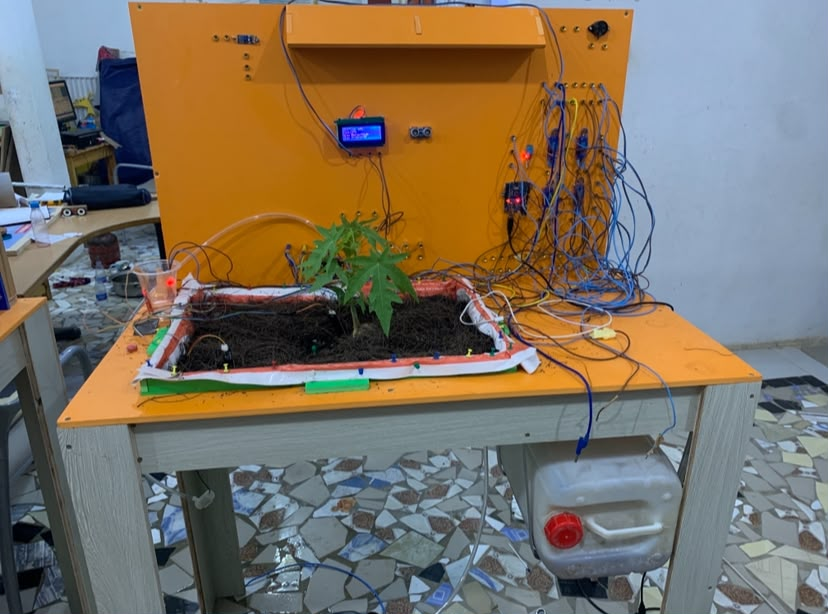

# Smart Irrigation System — IoT Educational Test Bench

An Arduino-based educational test bench designed to help students learn IoT through hands-on projects involving sensors, automation, irrigation and water recycling.

## Overview

This project is a complete modular irrigation test bench designed for practical IoT training.

Students can connect, test and program different components to understand how sensors, actuators and embedded systems interact in a real-world application.

The system monitors soil moisture, water levels and user presence, while automatically controlling irrigation pumps and the lighting system.

## System Components

- Arduino Uno
- 2 soil moisture sensors
- 2 water reservoirs
- 2 water level sensors
- 2 water pumps
- Relay modules
- 16x2 I2C LCD
- Ultrasonic sensor
- 12V LED lighting
- CNC-cut PVC test bench

## Irrigation System

The system uses two water reservoirs:

### Clean Water Reservoir

The first reservoir contains clean water and is used as the primary water source.

### Recycled Water Reservoir

The second reservoir collects water after irrigation.

When enough recycled water is available, the system can use it for the next irrigation cycle.

This allows students to experiment with the concept of water reuse and automated resource management.

## How It Works

The two soil moisture sensors are placed at different locations to obtain more representative measurements.

The Arduino reads the sensor values and determines whether irrigation is required.

Depending on water availability:

1. The system checks soil moisture.
2. If the soil is dry, irrigation is requested.
3. Recycled water is used when available.
4. Clean water is used when recycled water is unavailable.
5. The corresponding pump is activated through a relay.
6. Water is distributed to the plants.
7. Part of the water is collected in the recycling reservoir.
8. The LCD displays system information.

## Presence Detection

An ultrasonic sensor detects whether a person is positioned in front of the test bench.

When a person is detected, the 12V LED lighting is activated to illuminate the workspace.

## Educational Purpose

The main objective of this project is not only to automate irrigation, but to provide students with a practical environment for learning IoT.

Students can experiment with:

- Sensors
- Actuators
- Relay control
- Analog and digital signals
- Embedded programming
- Automation logic
- Water management
- System testing
- Troubleshooting

The modular design allows components to be connected and disconnected easily between practical sessions.

## Technologies

`Arduino Uno` `C/C++` `IoT` `Electronics` `Sensors` `Relays` `Automation` `Embedded Systems` `Digital Fabrication`

## Project Status

Educational prototype / IoT test bench

## Author

**Souhibou Badiane**

Maker & Fab Manager

AstroLab — CyberisDev  
Ker Thiossan — FabLab Defko Ak Niep
